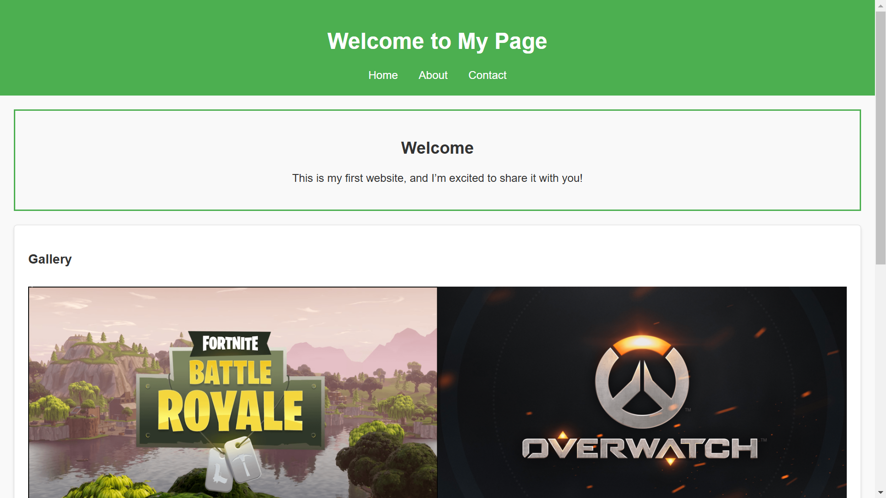
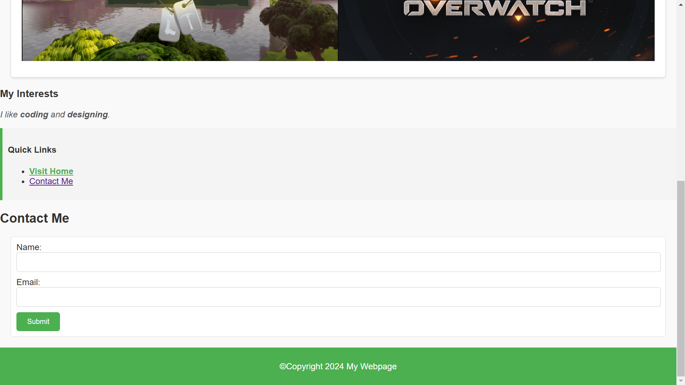

# HTML & CSS Fixer Upper: Clone, Improve, and Style!

Welcome to the **HTML & CSS Fixer Upper** challenge! This task is designed to enhance your problem-solving skills with HTML and CSS by working through a series of issues and styling improvements. Ready to dive in? Let's get started!

## 🚀 The Task

### 1. **Clone This Repository**
   Begin by cloning this repository to your local machine. Make sure you're all set up and ready to contribute!

### 2. **Create a Branch with Your Name**
   Create a new branch with your **name** as the branch name. This will help keep everything organized and ensure your work is easy to track.

### 3. **Fix the Problems in `index.html`**
   Inside the repository, you'll find an HTML file called `index.html`. This file contains **14 problems** that need fixing.  
   Go through each issue, fix them, **commit** your changes, and then **push** them to the repo.

### 4. **Clean Up and Externalize CSS**
   Next up, let's tidy things up! Remove any internal or inline CSS styling from the `index.html` file, and move all the styles to an **external CSS file**.

### 5. **Match the End Goal Design**
   Your final challenge is to match the design of the end goal site, which is provided below. Use CSS to make the page look exactly like the final design.

---

## 🖼️ Gallery Section Images

To make the gallery section come to life, use the following image links:

- https://via.assets.so/game.png?id=12
- https://via.assets.so/game.png?id=14

---

## 🎨 Color Palette

Here are the colors you’ll need to match in your design:

- **Accent Color**: `#4caf50`
- **Link Hover Color**: `#007bff`

---

## 🎯 Our End Goal

Check out the design you’ll be working towards. The goal is to match these styles and layout using CSS.

---

## 🏁 How to Get Started

1. **Clone** the repository
2. **Create** a branch named after you
3. **Fix** the issues in `index.html` and commit your changes
4. **Remove** inline CSS and move styles to an external CSS file
5. **Style** the page to match the end goal design

Once you're done, make sure your code is clean, functional, and beautiful. Then, submit your pull request, and let's see your work shine!

---

Good luck, and happy coding! 🎉
